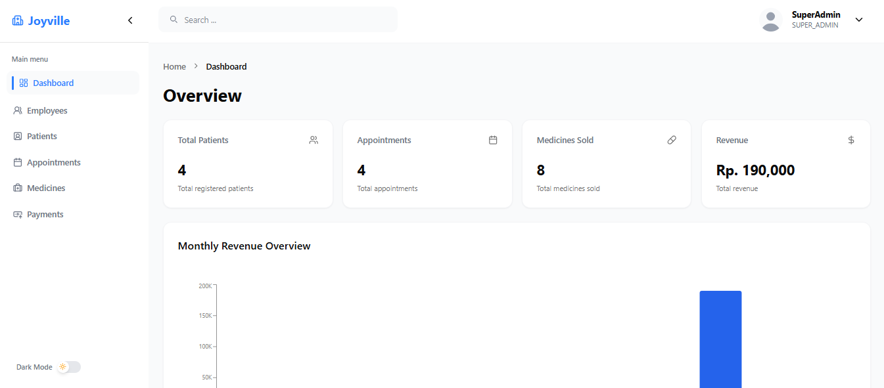

# Joyville - Medical Center ERP



Joyville Medical Center ERP is a small to medium-scale clinic/hospital management system built with modern technology to simplify internal workflows such as patient registration, appointment management, medical records, drug inventory, payments, and operational reports.

## Features

### **Authentication & Authorization**
* Login & Register (admin, doctor, appothecary, cashier, user)
* Role-based Access Control (RBAC)

### **Dashboard**
* Daily patient statistics
* Revenue overview
* Recent activity

### **Employee Management**
* Employee list
* Add, edit, and delete employees
* Role and access management

### **Patient Management**
* Add new patients
* Edit and delete patient data
* Patient details & visit history
* Quick patient search
* Create appointments directly from the patient page

### **Appointment Management**
* Daily appointment list
* Complete appointments
* Send appointments to the pharmacy

### **Prescriptions**
* Doctors fill prescriptions after examination
* Pharmacies automatically receive prescriptions
* Medication quantities and instructions
* Automatically reduce stock medications

### **Medicine Inventory**
* Add, edit, delete medications
* Real-time medication inventory

### **Payment**
* Payment process after medication is completed
* Patient billing details
* Status: unpaid → paid


## Technology Stack

* **Next.js** – Frontend & backend routes
* **TailwindCSS** – UI styling
* **Shadcn/UI** – Components UI
* **Supabase (PostgreSQL)** – Database service
* **Prisma / Supabase Client** – ORM/DB client
* **Next Auth** - Authentication solution
* **Zustand** - State management

## Getting Started


### Installation

1. Clone repository:

```
git clone https://github.com/rezakurniawan88/joyville-medical
```

2. Install dependencies:

```
pnpm install
```

3. Set up environment variables:

```
cp .env.example .env
```

4. Update your .env with your credentials.

5. Run database migrations:
```
npx prisma migrate dev
```

6. Start the development server:

```
pnpm dev
```

7. Open your browser at http://localhost:3000